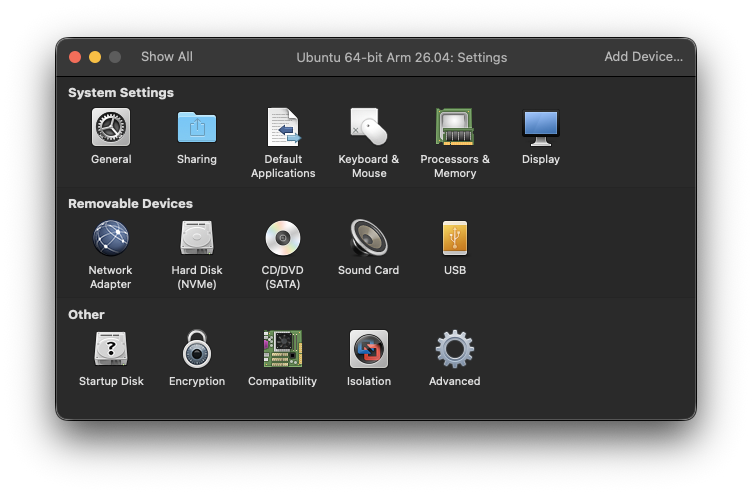
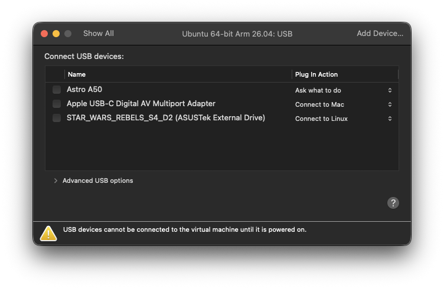

# MKV Auto on macOS — Linux VM setup

Read [why this is necessary](VM_SETUP.md) first if you have not.

**This procedure is verified.** It was run end to end on an Apple Silicon Mac
(M3 Ultra, macOS 26.5) with VMware Fusion and a USB Blu-ray drive: a real disc
scanned and a 1.3 GB title ripped to a valid MKV.

## Choose your VM software

**Use VMware Fusion.** It is what this guide was tested with, it is free, and it
has the most mature USB implementation of the options on Apple Silicon.

| | Verdict |
|---|---|
| **VMware Fusion** | **Recommended and tested.** Free, USB passthrough confirmed working on Apple Silicon |
| **Parallels Desktop** | Should work — mature USB support. Paid. Untested here |
| **UTM** | **Avoid.** USB passthrough only on its QEMU backend, and upstream QEMU has an open issue titled "USB passthrough on Apple Silicon is unusable" |
| **VirtualBox** | Runs on Apple Silicon since 7.1, but USB passthrough is documented as inconsistent — see the callout below |

Vendors implement USB passthrough independently, so UTM's problems say nothing
about Fusion. That is exactly why Fusion works despite the QEMU issue.

> **Tried VirtualBox instead? Please tell us.** We have not tested it on
> Apple Silicon, and its USB passthrough is documented upstream as inconsistent
> — so we cannot recommend it yet. If you try it and it works (or doesn't),
> [open an issue](https://github.com/MKV-Auto/mkv-auto-release/issues) with your
> host, VirtualBox version, drive model, and what happened. Enough reports and
> it becomes a supported path.

## 1. Install VMware Fusion

Download from the Broadcom support portal and install. **Fusion is free for
personal and commercial use and needs no licence key** (13.5.2 and later) — you
only need a free Broadcom account to reach the download.

## 2. Create the VM

Download a Linux Server ISO **matching your Mac's architecture**:

- **Apple Silicon (M1–M4)** → Ubuntu Server **arm64**
- **Intel Mac** → Ubuntu Server **amd64**

On Apple Silicon you must use an arm64 guest. An x86_64 guest would be emulated
and far too slow to rip.

Create the VM from the ISO, then before starting it, open **Settings** and set:

- **Processors & Memory** — 4 GB RAM minimum, **8 GB recommended**
- **Hard Disk** — **200 GB minimum**. Rips land in the VM's `/data` volume
  before they go anywhere else, and a single 4K disc can be around 70 GB, so
  60 GB is not enough to finish one job. Add more if you keep rips on the VM
  rather than transferring them off.

Install Ubuntu Server normally. A desktop environment is unnecessary and wastes
RAM. Enable OpenSSH during install so you can work from Terminal.

## 3. Pass the drive through

**Start the VM first.** Fusion cannot hand a USB device to a VM that is powered
off — it will tell you so.

Then open **Settings → USB** (under *Removable Devices*):



Your drive appears in the list. Fusion labels optical drives by the **disc
currently loaded**, so look for the disc name rather than the drive model — e.g.
`STAR_WARS_REBELS_S4_D2 (ASUSTek External Drive)`.

Set its **Plug In Action** to **Connect to Linux**:



That makes the setting stick — the drive reattaches to the VM automatically
whenever it is plugged in, instead of being reconnected by hand after every
restart. `Ask what to do` prompts each time; `Connect to Mac` keeps it on macOS.

macOS releases the drive as Fusion takes it. If macOS has a disc mounted, eject
it in Finder first.

> **Tip: remove Fusion's virtual CD drive.** Settings → *Removable Devices* also
> lists a **CD/DVD (SATA)** device. That is a virtual drive, and it is why your
> real drive often ends up as `/dev/sr1` rather than `/dev/sr0`. With the VM shut
> down you can remove or disable it, after which your real drive is the only
> optical device and becomes `/dev/sr0`. Not required — but it removes the single
> most confusing part of this setup.

## 4. Verify the drive reached Linux

In the VM:

```bash
lsusb
```

Your drive should appear — e.g. `ASUSTek Computer, Inc. External Drive`.

```bash
ls -l /dev/sr*
```

**You will probably see two devices.** VMware presents its own virtual CD, so
the real drive is often **`/dev/sr1`**, not `/dev/sr0`. Identify it:

```bash
cat /proc/sys/dev/cdrom/info
```

Then confirm the real one reads a disc:

```bash
sudo dd if=/dev/sr1 of=/dev/null bs=1M count=50 status=progress
```

50 MB without errors means passthrough is working.

## 5. Install Docker and MKV Auto

```bash
sudo apt update && sudo apt install -y docker.io
sudo usermod -aG docker $USER && newgrp docker
```

Then run MKV Auto — **passing the device you identified above**:

```bash
docker run -d \
  --name mkv-auto \
  -p 8080:80 \
  -v mkv-data:/data \
  --device=/dev/sr1 \
  --privileged \
  --restart unless-stopped \
  ghcr.io/mkv-auto/mkv-auto-release:latest
```

Unsure which device is real? Pass both — the app enumerates drives itself and
will show the correct one:

```bash
  --device=/dev/sr0 --device=/dev/sr1 \
```

On Apple Silicon Docker pulls the **arm64** image automatically; the tag is
multi-arch.

## 6. Open the web UI

Find the VM's address:

```bash
hostname -I
```

Then browse to `http://<VM-IP>:8080` from your Mac. With Fusion's default NAT
networking the VM is reachable from your Mac but not from other devices on your
network — switch the VM to **Bridged** networking if you want that.

The setup wizard will install MakeMKV on first run.

## Troubleshooting

**`MSG:5010 Failed to open disc`** — you are almost certainly targeting
VMware's virtual CD rather than your real drive. Check `/dev/sr1`.

**Drive disappears after restarting the VM** — its **Plug In Action** is not set
to *Connect to Linux*. With that set (step 3) it reattaches automatically.

**Drive not listed in Settings → USB** — either the VM is powered off (Fusion
cannot attach USB to a stopped VM) or macOS is holding the drive. Start the VM,
eject any mounted disc in Finder, then retry.

**Can't find the drive by name** — Fusion labels optical drives by the disc
loaded in them, not the drive model. Look for the disc title.

**Rips are slow** — the drive is behind USB passthrough plus virtualisation.
Some overhead is expected. Give the VM more RAM and CPU cores if it is severe.

**Multi-drive setups** — VMware does not expose stable per-drive serials, so
MKV Auto falls back to a `sysfs`-derived identity. Single drives are unaffected,
but multi-drive under a VM cannot rely on stable identity if devices renumber.
