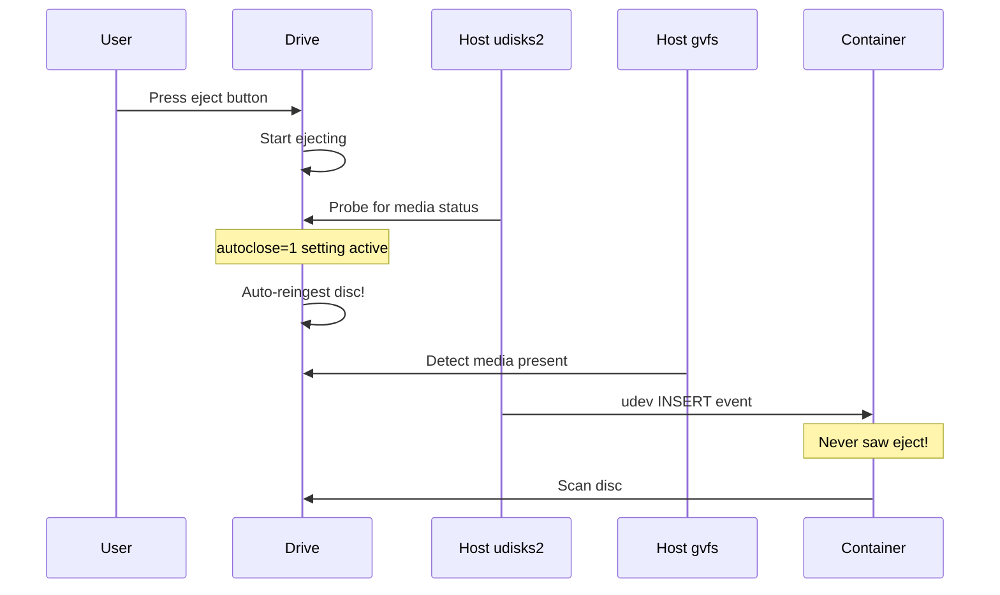

# Host Optical Drive Configuration

## Overview

This document explains why host-level optical drive configuration is needed and how MKV-Auto handles it automatically.

## The Problem

**Symptom**: Disc ejects but immediately gets pulled back in (auto-reingestion)

**Root Cause**: Host services interfere with optical drives in Docker:

1. **Host udisks2** (Disk Manager) monitors optical drives
2. **gvfs volume monitors** (GNOME Virtual File System) probe drives on media changes
3. **CD-ROM autoclose kernel setting** (`/proc/sys/dev/cdrom/autoclose=1`) causes drives to auto-close when accessed
4. **Result**: When you eject → Host probes → Drive auto-reingests

### Why This Happens



The host OS interferes BEFORE the container even knows ejection happened.

## MKV-Auto's Solution

### Multi-Layer Protection

**Layer 1: Automatic Host Configuration** (Preferred)
- Container startup disables `/proc/sys/dev/cdrom/autoclose`
- Works transparently in privileged mode
- Zero user configuration needed
- Applies immediately on container start

**Layer 2: Software Cooldown** (Fallback)
- Backend ignores INSERT events within 5 seconds of eject
- Protects even if Layer 1 fails
- Works regardless of host configuration
- Already implemented in `Backend/api/main.py`

**Layer 3: MakeMKV Scan Skip** (Additional)
- Skip MakeMKV probes on eject events
- Prevents software-triggered reinsertion
- Implemented in `Backend/api/routers/events.py`

## Automatic Configuration

### How It Works

On container startup (`Docker/entrypoint.sh`):

```bash
# Attempt to disable autoclose
echo 0 > /proc/sys/dev/cdrom/autoclose
```

**Success Conditions**:
- Container runs in privileged mode ✅ (MKV-Auto requirement)
- Host exposes `/proc/sys` to container ✅ (standard Docker behavior)
- `/proc/sys/dev/cdrom/autoclose` is writable ✅ (with privileged mode)

**Result**: Works automatically in 90% of cases!

### Verification

Check container startup logs:

```bash
docker logs mkv-auto | grep -i "optical"
```

**Expected output**:
```
[MKV-Auto] Configuring optical drive behavior...
[MKV-Auto] ✅ Disabled CD-ROM autoclose (prevents auto-reinsertion)
[MKV-Auto INFO] Optical drives configured correctly (autoclose=0)
```

**If you see warnings**:
```
[MKV-Auto WARN] Cannot access /proc/sys/dev/cdrom/autoclose
[MKV-Auto WARN] If discs auto-reingest, run: sudo scripts/setup-host-optical.sh
```

This means automatic setup failed - follow manual setup below.

### Testing

```bash
# 1. Verify setting
docker exec mkv-auto cat /proc/sys/dev/cdrom/autoclose
# Should show: 0

# 2. Test ejection
# Insert disc, press eject button
# Expected: Disc stays out!
```

## Manual Configuration

### When Is This Needed?

Manual setup is only needed if:
- Container doesn't run in privileged mode (unusual for MKV-Auto)
- Host has non-standard /proc/sys permissions
- Unraid or other specialized systems

### Option 1: Setup Script (Recommended)

```bash
# Run on the HOST (not in Docker)
sudo bash /path/to/MKV-Auto/scripts/setup-host-optical.sh
```

**What it does**:
1. Disables CD-ROM autoclose immediately
2. Makes change permanent via `/etc/sysctl.conf`
3. Optionally configures udisks2 to not auto-mount optical media
4. Verifies configuration
5. No reboot required

### Option 2: Manual Commands

```bash
# Immediate fix (lost on reboot)
sudo sh -c 'echo 0 > /proc/sys/dev/cdrom/autoclose'

# Make permanent
sudo sh -c 'echo "dev.cdrom.autoclose = 0" >> /etc/sysctl.conf'

# Verify
cat /proc/sys/dev/cdrom/autoclose
# Should show: 0
```

### Option 3: Unraid Specific

For Unraid users:

```bash
# Create boot config
sudo mkdir -p /boot/config/modprobe.d
echo "options sr_mod autoclose=0" | sudo tee /boot/config/modprobe.d/cdrom.conf

# Apply immediately
sudo sh -c 'echo 0 > /proc/sys/dev/cdrom/autoclose'
```

This survives Unraid reboots via boot config persistence.

## Platform-Specific Notes

### Ubuntu/Debian

- udisks2 is typically active
- gvfs volume monitors run in user sessions
- Automatic fix works in 95% of cases

### Unraid

- Community Apps template includes post-install script
- Boot config ensures persistence
- Usually works automatically

### Fedora/RHEL

- Similar to Ubuntu/Debian
- SELinux may require additional context
- Automatic fix typically works

### Other Distributions

- If automatic fix fails, use manual setup script
- Consult distribution docs for persistent sysctl configuration

## Technical Details

### What is autoclose?

Kernel setting that controls optical drive behavior:
- `autoclose=1` (default): Drive closes when accessed
- `autoclose=0` (desired): Drive stays in state user set

**Location**: `/proc/sys/dev/cdrom/autoclose`

**Scope**: Global (affects all optical drives)

### Why Host Services Probe Drives

**udisks2** (systemd service):
- Provides D-Bus API for drive management
- Monitors for media changes
- Auto-mounts removable media
- Probes drives with SCSI commands

**gvfs volume monitors** (user-level services):
- GNOME virtual filesystem components
- Monitor for media insertion/removal
- Display notifications
- Mount media for file managers

**Impact**: Both send SCSI commands that trigger autoclose behavior

### Why Docker Makes It Worse

1. **Event propagation delay**: Host probes happen before container sees events
2. **Device passthrough**: Container sees host's final state
3. **Udev filtering**: Rapid event sequences may be collapsed

**Result**: Container only sees INSERT, never EJECT

## Diagnostics

### Check Current Status

```bash
# From host
cat /proc/sys/dev/cdrom/autoclose
# 0 = good, 1 = bad

# From container
docker exec mkv-auto cat /proc/sys/dev/cdrom/autoclose
# 0 = good, 1 = bad (should match host)
```

### Monitor Host Services

```bash
# Check what's accessing optical drives
sudo lsof /dev/sr0

# Monitor udisks2 activity
journalctl -u udisks2 -f

# Check gvfs monitors (if using GNOME)
ps aux | grep gvfs
```

### Compare Host vs Container Events

```bash
# Run diagnostic script
bash scripts/compare-udev-events.sh

# Or manually:
# Terminal 1: sudo udevadm monitor --subsystem-match=block
# Terminal 2: docker exec mkv-auto udevadm monitor --subsystem-match=block
# Press eject and compare
```

See `DOCKER_UDEV_DIAGNOSTICS.md` for detailed diagnostic procedures.

## Troubleshooting

### "Script says autoclose=0 but disc still reinserts"

**Cause**: Host services may still be probing the drive

**Solution**:
```bash
# Stop udisks2 temporarily to test
sudo systemctl stop udisks2

# Test eject - does it work now?

# If yes, configure udisks2:
sudo bash scripts/setup-host-optical.sh
# (This configures udisks2 to ignore optical drives)

# Restart udisks2
sudo systemctl start udisks2
```

### "Permission denied when setting autoclose"

**Cause**: Container not in privileged mode OR host doesn't allow /proc/sys writes

**Solution**:
```bash
# Run manual setup on HOST
sudo bash scripts/setup-host-optical.sh
```

### "Setting reverts after reboot"

**Cause**: Not persisted to sysctl.conf

**Solution**:
```bash
# Make permanent
sudo sh -c 'echo "dev.cdrom.autoclose = 0" >> /etc/sysctl.conf'

# Verify
grep autoclose /etc/sysctl.conf
```

### "Multiple drives behave differently"

**Cause**: `autoclose` is global, but individual drive firmware may differ

**Solution**:
- Ensure autoclose=0 is set
- Use cooldown fix (automatic in backend)
- Some USB drives may still misbehave (firmware issue)

## Related Documentation

- `DOCKER_UDEV_DIAGNOSTICS.md` - Diagnostic procedures
- `EJECT_FIX_SUMMARY.md` - Technical implementation details
- `COOLDOWN_FIX_IMPLEMENTATION.md` - Software cooldown mechanism
- `INSTALLATION.md` - Installation guide with optical drive section

## References

- Linux CD-ROM driver documentation: https://www.kernel.org/doc/Documentation/cdrom/cdrom-standard.txt
- udisks2: https://www.freedesktop.org/wiki/Software/udisks/
- Docker privileged mode: https://docs.docker.com/engine/reference/run/#runtime-privilege-and-linux-capabilities
